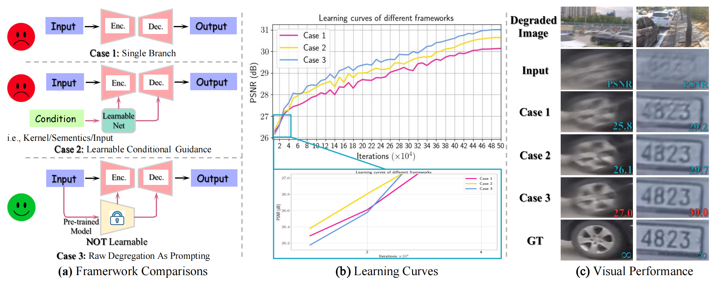
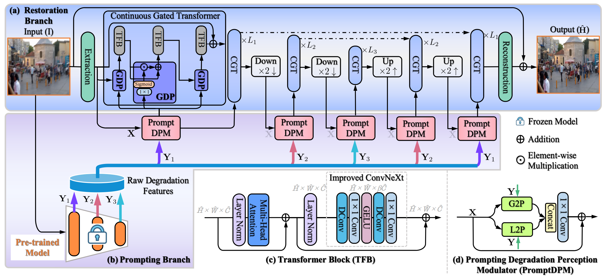
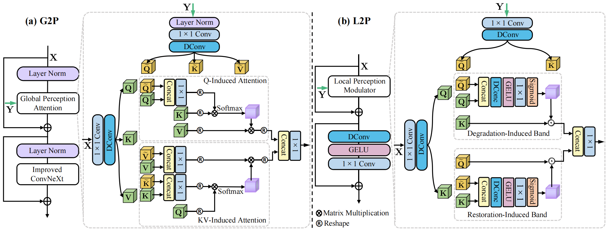

# PromptRestorer [NeurIPS-23]

This is the official PyTorch codes for the paper  
[PromptRestorer: A Prompting Image Restoration Method with Degradation Perception](https://proceedings.neurips.cc/paper_files/paper/2023/file/1c364d98a5cdc426fd8c76fbb2c10e34-Paper-Conference.pdf)  
[Cong Wang](https://scholar.google.com/citations?user=0DrHHRwAAAAJ&hl=zh-CN), [Jinshan Pan](https://jspan.github.io/), Wei Wang, [Jiangxin Dong](https://scholar.google.com/citations?hl=zh-CN&user=ruebFVEAAAAJ), Mengzhu Wang, [Yakun Ju](https://scholar.google.com/citations?hl=zh-CN&user=hE10pMYAAAAJ), [Junyang Chen](https://scholar.google.com/citations?hl=zh-CN&user=Q0u3dRQAAAAJ)

## Abstract
We show that raw degradation features can effectively guide deep restoration models, providing accurate degradation priors to facilitate better restoration. 
While networks that do not consider them for restoration forget gradually degradation during the learning process, model capacity is severely hindered. 
To address this, we propose a Prompting image Restorer, termed as PromptRestorer. 
Specifically, PromptRestorer contains two branches: a restoration branch and a prompting branch. 
The former is used to restore images, while the latter perceives degradation priors to prompt the restoration branch with reliable perceived content to guide the restoration process for better recovery. 
To better perceive the degradation which is extracted by a pre-trained model from given degradation observations, 
we propose a prompting degradation perception modulator, which adequately considers the characters of the self-attention mechanism and pixel-wise modulation, to better perceive the degradation priors from global and local perspectives. 
To control the propagation of the perceived content for the restoration branch, we propose gated degradation perception propagation, enabling the restoration branch to adaptively learn more useful features for better recovery. 
Extensive experimental results show that our PromptRestorer achieves state-of-the-art results on 4 image restoration tasks, including image deraining, deblurring, dehazing, and desnowing.

## Motivation

**(a)** compares different restoration frameworks.
Unlike existing approaches that are built within the architectures such as **Cases 1-2**, which are unable to memorize the degradation well during the learning process, we propose a prompting method (**Case 3**) that directly exploits raw degradation features extracted by a pre-trained model from the given degradation observations to guide restoration. 
In **(b)**, we observe that both **Cases 1-2** outperform our method in early iterations, as they effectively memorize degraded information. 
However, both **Cases 1-2** experience degradation vanishing with further iterations, while our prompting method persists in guiding the restoration network with accurate degradation priors, accordingly producing better restoration quality. 
In **(c)**, visual performance demonstrates that our prompting method recovers sharper images.


## Overall of PromptRestorer

Overall pipeline of our **PromptRestorer**.
PromptRestorer contains two branches: **(a)** the restoration branch and **(b)** the prompting branch. 
The restoration branch is used to restore images, where each block **(c)** in CGT is prompted by the prompting branch. 
The prompting branch first generates precise degradation features extracted by a pre-trained model from degradation observations, 
then these features prompt the restoration branch to facilitate better restoration via PromptDPM **(d)**.

## Prompting Degradation Perception Modulator

To better perceive the degradation to prompt the restoration network with more reliable perceived content from the degradation priors, we propose the PromptDPM.
The PromptDPM consists of 1) **G**lobal **P**rompting **P**erceptor (**G2P**) and 2) **L**ocal **P**rompting **P**erceptor (**L2P**) to respectively perceive the degradation from global and local perspectives, 
enabling to generate more useful content to guide the restoration branch.


## Dependencies and Installation

- Ubuntu >= 18.04
- CUDA >= 11.0
- Other required packages in `requirements.txt`
```
# git clone this repository
git clone https://github.com/supersupercong/PromptRestorer.git
cd UHDformer 

# create new anaconda env
conda create -n promptrestorer python=3.8
source activate promptrestorer 

# install python dependencies
pip3 install -r requirements.txt
python setup.py develop
```


### Train

```
bash train.sh
```

### Test

```
bash test.sh
```


## Citation
```
@inproceedings{PromptRestorer,
  author       = {Cong Wang and
                  Jinshan Pan and
                  Wei Wang and
                  Jiangxin Dong and
                  Mengzhu Wang and
                  Yakun Ju and
                  Junyang Chen},
  title        = {PromptRestorer: {A} Prompting Image Restoration Method with Degradation
                  Perception},
  booktitle    = {NeurIPS},
  year         = {2023},
}
```

## License

<a rel="license" href="http://creativecommons.org/licenses/by-nc-sa/4.0/"></a><br />This work is licensed under a <a rel="license" href="http://creativecommons.org/licenses/by-nc-sa/4.0/">Creative Commons Attribution-NonCommercial-ShareAlike 4.0 International License</a>.

## Contact

Contact: Cong Wang [supercong94@gmail.com]

## Acknowledgement

This project is based on [FeMaSR](https://github.com/chaofengc/FeMaSR).
